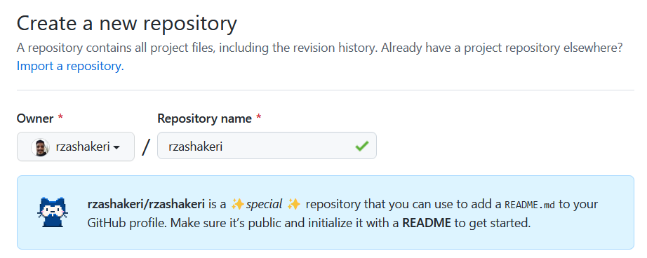
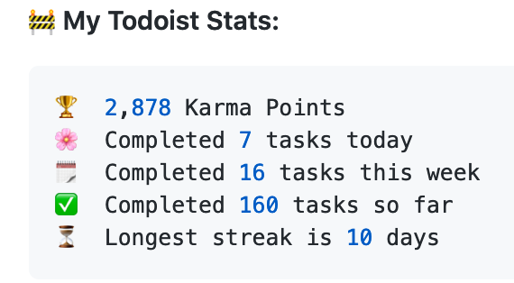
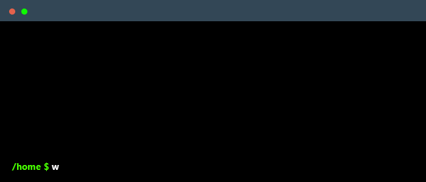
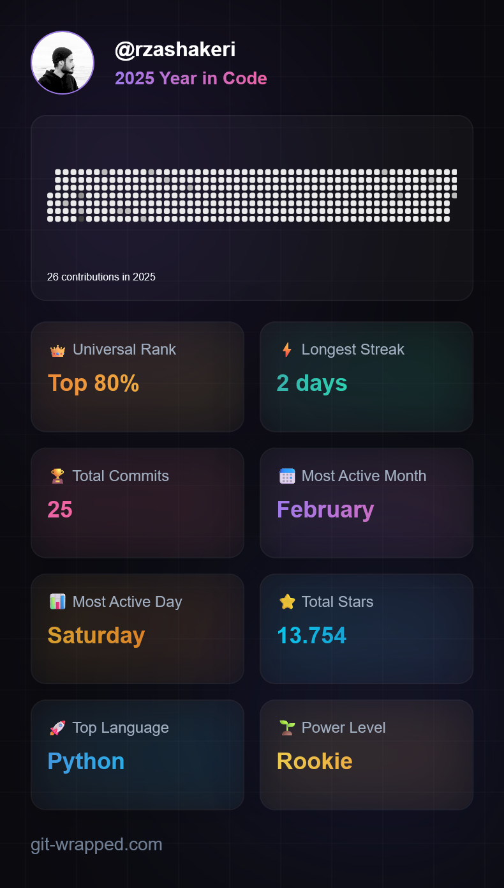
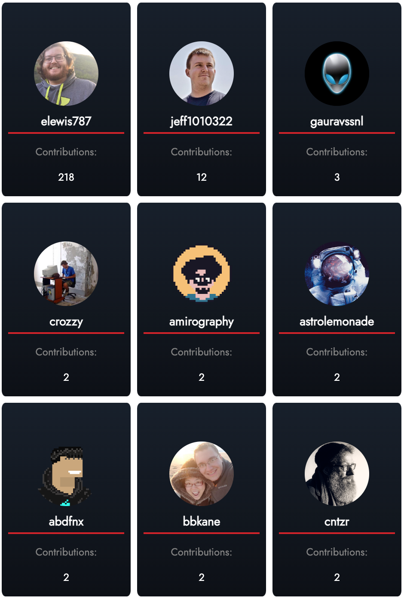
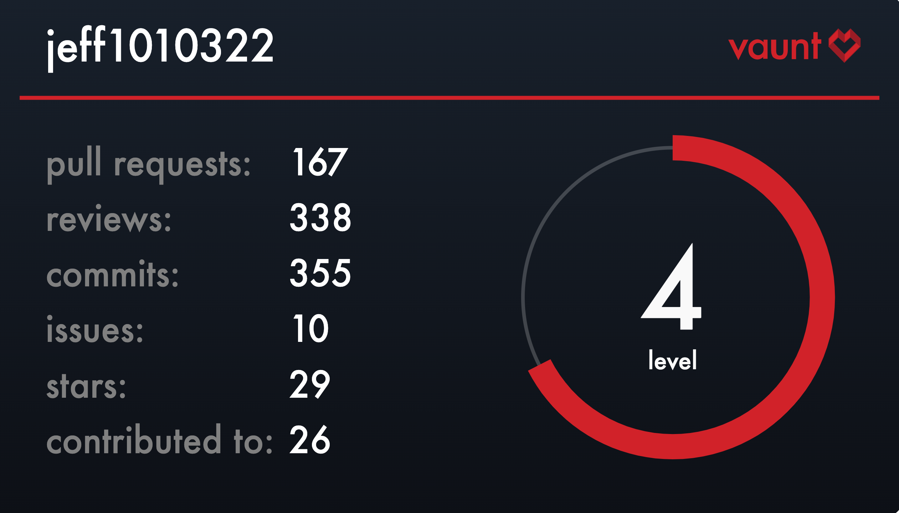
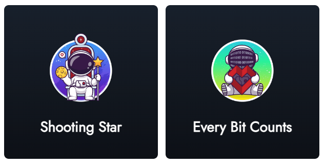
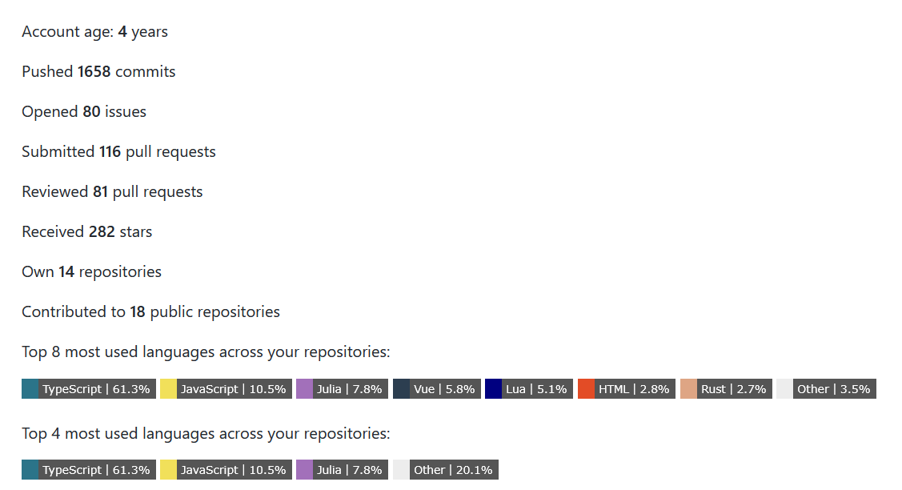
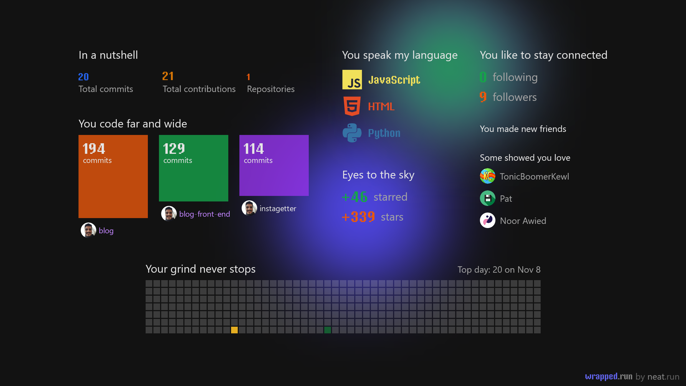

<p align="center">
  <a href="https://www.producthunt.com/posts/beautify-github-profile?utm_source=badge-featured&utm_medium=badge&utm_souce=badge-beautify&#0045;github&#0045;profile" target="_blank">
    
  </a>
  <a href="https://www.producthunt.com/posts/beautify-github-profile?utm_source=badge-top-post-badge&utm_medium=badge&utm_souce=badge-beautify&#0045;github&#0045;profile" target="_blank">
    
  </a>
  <a href="https://www.producthunt.com/posts/beautify-github-profile?utm_source=badge-review&utm_medium=badge&utm_souce=badge-beautify&#0045;github&#0045;profile#discussion-body" target="_blank">
    
  </a>
</p>

<p align="center">
  
  
  
  
  
  
  
  
<a href="readme-fa.md"></a>
</p>


---

# Hello friends 🖐️
How are you? If you want to make the look of your github profile more beautiful, you have come to the right place.

# 📖 Table of Contents
- [📌 The first step : Set up the GitHub Repository](#-the-first-step--set-up-the-github-repository)
- [💡 Where do we get ideas ?](#-where-do-we-get-ideas-)
- [🚩 What do we do after seeing these profiles ?](#-what-do-we-do-after-seeing-these-profiles-)
  - [🧩 Badges ](#-badges-)
  - [🛠️ Widgets ](#%EF%B8%8F-widgets-)
  - [✅ Icons ](#-icons-)
  - [⚙️ Profile Generator ](#%EF%B8%8F-profile-generator-)
  - [😉 Emojis ](#-emojis)
- [Give A Star ⭐](#give-a-star-)

# 📌 The first step : Set up the GitHub Repository
Create a repository with your GitHub username 👇



Template : 👇
```
https://github.com/username/username
```

Example : 👇
```
https://github.com/rzashakeri/rzashakeri
```

### After Create Repository, **Create a README.md** in Repository and Done ✅
Now that we have built the repository, we come to the interesting part: **designing our README.md.**

> Persian guide for first step 👉 [Link 🔗](https://www.instagram.com/p/CQlxnAnHId0/)

# 💡 Where do we get ideas ?
You must have been asked which profiles to get ideas from? You can see the profile of different people through the site below the gateway profile and get ideas from them 👇

### [🔗 Awesome Github Profile ](https://zzetao.github.io/awesome-github-profile/)

# 🚩 What do we do after seeing these profiles ?
Well, so far you have been able to find cool ideas from the profiles of different people. Now it's time to use different tools to beautify your github profile, which you can access from the list below.

## 🧩 Badges 👇
<details>
 <summary><strong>Click to expand list</strong></summary>
  
### 1 . [List of Badges, in Markdown](https://github.com/Naereen/badges)
A list of badges and cards, with their Markdown code, that can be included in a README.md file for a GitHub

📍 For example :
<p align="center">
  <a href="https://GitHub.com/Naereen/ama">
    
  </a>
  <a href="https://pypi.python.org/pypi/ansicolortags/">
    
  </a>
  <a href="https://GitHub.com/Naereen/StrapDown.js/network/">
    
  </a>
  <a href="https://GitHub.com/Naereen/StrapDown.js/stargazers/">
    
  </a>
</p>

### 2 . [Markdown badges in many different categories ](https://github.com/Ileriayo/markdown-badges)
Badges for your personal developer branding, profile, and projects.

📍 For example :
<p align="center">
  
  
  
  
</p>

### 4 . [shields](https://shields.io/)
Concise, consistent, and legible badges in SVG and raster format and Make tokens with custom values

📍 For example :
<p align="center">
  
  
  
</p>

### 5 . [laravel github profile view counter](https://github.com/caneco/laravel-github-profile-view-counter)
This package will allows you to track Github profile views and display them in your profile readme, for free.

📍 For example :
<p align="center">
  
</p>

### 6 . [Stackoverflow Badge](https://github.com/claytonjhamilton/stackoverflow-badge)
Display your stats with this unique StackOverflow Badge

📍 For example :
<p align="center">
  
</p>

### 7 . [Badges for GitHub](https://github.com/Envoy-VC/Badges-for-GitHub)
A Curated list of Badges used in GitHub

📍 For example :
<p align="center">
  
  
  
</p>

### 8 . [Badges 4 README.md Profile](https://github.com/alexandresanlim/Badges4-README.md-Profile)
Improve your README.md profile with these amazing badges.

📍 For example :
<p align="center">
  
  
  
</p>

### 9 . [Github Profile Views Counter](https://github.com/antonkomarev/github-profile-views-counter)
It counts how many times your GitHub profile has been viewed. Free cloud micro-service.

📍 For example :
<p align="center">
  
  
</p>

### 10 . [ColoredBadges](https://github.com/MikeCodesDotNET/ColoredBadges)
Some badges I created for my GitHub profile readme.

📍 For example :
<p align="center">
  
  
</p>

### 11 . [AppVeyor](https://www.appveyor.com/docs/status-badges/)
A Project status badge is a dynamically generated image displaying the status of the last build. You can put a status badge on the home page of your GitHub project or intranet portal:

📍 For example :
<p align="center">
  
  
</p>

### 12 . [For The Badge](https://github.com/BraveUX/for-the-badge)
Badges for badges' sake.

📍 For example :
<p align="center">
  
  
</p>

### 13 . [Grunt Badge](https://gruntjs.com/built-with-grunt-badge)
Do you use Grunt in a project and want to proudly display that in your project README or on your project website? Now you can with the "Built with Grunt" badge!

📍 For example :
<p align="center">
  
  
</p>

### 14 . [semaphoreci Status Badges](https://docs.semaphoreci.com/essentials/status-badges/)
Create a badge that displays your project's current build status. The build status is determined by the status of the first pipeline in your newest workflow. You can use this badge in your project's README file or any web page.

📍 For example :
<p align="center">
  
</p>

### 15 . [Aoc Badges Action](https://github.com/J0B10/aoc-badges-action)
Github Action to update the badges of your Readme to show your current Advent of Code stats

📍 For example :
<p align="center">
  
  
  
</p>

### 16 . [Github Badges](https://github.com/eugustavo/github-badges)
Application made to create badges for your readme 📑

📍 For example :
<p align="center">
  
</p>

### 17 . [Discord Md Badge](https://github.com/ashmonty/discord-md-badge)
Add to your GitHub readme a badge that shows your Discord username and presence!

📍 For example :
<p align="center">
  
</p>

### 18 . [simple badges](https://github.com/developStorm/simple-badges)
Awesome Simple Icons on your favorite Shields.io Badges. Try out on your profile today!

📍 For example :
<p align="center">
  
  
  
</p>

### 19 . [GitHub Profile Badges](https://github.com/Aveek-Saha/GitHub-Profile-Badges)
Clean badges for your GitHub Profile Readme

📍 For example :
<p align="center">
  
  
</p>

### 20 . [Custom Icon Badges](https://github.com/DenverCoder1/custom-icon-badges)
Allows users to more easily use Octicons and their own icons and logos in shields.io badges

📍 For example :
<p align="center">
  
  
  
  
  
  
</p>

### 21 . [pepy](https://github.com/psincraian/pepy)
pepy is a site to get statistics information about any Python package

📍 For example :
<p align="center">
  <a href="https://pepy.tech/project/django-audio-validator">
    
  </a>
</p>

### 22 . [Version Badge](https://badge.fury.io/)
Once the package owner adds this badge to their README file, it will inform and link all visitors to the latest version of that package.

📍 For example :
<p align="center">
  <a href="https://badge.fury.io/py/django-audio-validator">
    
  </a>
</p>

### 24 . [hits](https://github.com/silentsoft/hits)
📈 Hit Counter for Your GitHub or Any Kind of Websites You Want. 

📍 For example :
<p align="center">
  
</p>

### 25 . [gradient badge](https://github.com/bokub/gradient-badge)
   *The demo page doesn't work anymore. But you can still use the service via a url like this: `https://gradgen.bokub.workers.dev/npm/v/gradient-badge?gradient=b65cff,11cbfa`.*

🍭 Badge generator with color gradient support

📍 For example :
<p align="center">
  
  
  
  
</p>

### 27 . [GitHub Profile Views Counter](https://github.com/u8views/go-u8views/)

Track your GitHub profile views and analyze statistics.

📍 For example :
<p align="center">
  <br>
  <a href="https://u8views.com/github/YaroslavPodorvanov">
    
  </a>
</p>

### 28 . [m3-Markdown-Badges ](https://github.com/ziadOUA/m3-Markdown-Badges)
🏅 A Material You inspired markdown badge collection.

📍 For example :
<p align="center">
  
  
</p>

### 29 . [Badgen](https://github.com/badgen/badgen.net)
Fast badge generating service

📍 For example :
<p align="center">
  
  
  
</p>

### 30 . [Stardev](https://stardev.io/)
Stardev ranks every GitHub user and repository by language and location. You can get a HTML or Markdown badge that shows your global rank across all languages and your top languages by star count.

📍 For example :
<p align="center">
  <a href="https://stardev.io/developers/oliyh">
    
  </a>
</p>

### Outdated
<details>
 <summary><strong>Click to expand list</strong></summary>

The servers of these projects are down. But they are still interesting for inspiration or forking.

### 3 . [View Count Badge](https://github.com/dwyl/hits)
A badge generator service that counts views on your markdown file.

📍 For example :
<p align="center">
  
</p>

### 23 . [Peerlist Profile Badge](https://github.com/vinitshahdeo/peerlist-readme-badge)
[Peerlist](https://peerlist.io/) is a community of working professionals focused on building a personal brand, sharing professional content, and finding peers to collaborate with. A [Peerlist profile](https://peerlist.io/vinitshahdeo) can be used as a simple resume or a complete portfolio to showcase your work. You can style your profile `README.md` with an awesome Peerlist markdown badge.

📍 For example :
<p align="center">
  
</p>

### 26 . [Topmate Profile Badge](https://github.com/vinitshahdeo/topmate-readme-badge)
Topmate is a platform to connect 1:1 with your audience & monetise your time better. Basically, [one link](https://topmate.io/vinitshahdeo) to do it all. Even better, you can now add a markdown badge in your GitHub profile README to connect with your community! Try it out here: [topmate-readme-badge.netlify.app](https://topmate-readme-badge.netlify.app/)

</details>

---

</details>

## 🛠️ Widgets 👇
<details>
 <summary><strong>Click to expand list (1~50)</strong></summary>
  
### 1 . [Todoist Readme](https://github.com/abhisheknaiidu/todoist-readme)
Updates README with Todoist Stats of a user

📍 For example :
<p align="center">
  
</p>

### 2 . [github readme stats](https://github.com/anuraghazra/github-readme-stats)
Dynamically generated stats for your github readmes

📍 For example :
<p align="center">
  
  
</p>

### 3 . [GitHub Readme Streak Stats](https://github.com/DenverCoder1/github-readme-streak-stats)
Stay motivated and show off your contribution streak! 🌟 Display your total contributions, current streak, and longest streak on your GitHub profile README

📍 For example :
<p align="center">
  
</p>

### 4 . [waka readme](https://github.com/athul/waka-readme)
Wakatime Weekly Metrics on your Profile Readme.

📍 For example :
<p align="center">
  
</p>

### 5 . [Profile Activity Generator](https://github.com/omidnikrah/profile-activity-generator)
Generate custom profile activity for your profile README

📍 For example :
<p align="center">
  
</p>

### 6 . [Github Activity Readme](https://github.com/jamesgeorge007/github-activity-readme)
Updates README with the recent GitHub activity of a user

📍 For example :
<p align="center">
  
</p>


### 7 . [Github Action Dynamic Profile Page](https://github.com/umutphp/github-action-dynamic-profile-page/)
GitHub Action to push updates to your special profile repository.

📍 For example :
<p align="center">
  
</p>

### 8 . [waka readme stats](https://github.com/anmol098/waka-readme-stats)
This GitHub action helps to add cool dev metrics to your github profile Readme

📍 For example :
<p align="center">
  
</p>


### 9 . [Profile Readme](https://github.com/actions-js/profile-readme)
Display profile activity and other cool widgets in your profile README.md

📍 For example :
```
💪 Opened PR #43 in webview/webview_deno
❗️ Closed issue #32 in denosaurs/denon
🗣 Commented on #6 in nestdotland/hatcher
❗️ Closed issue #22 in nestdotland/eggs
🗣 Commented on #15 in nestdotland/eggs
```

### 10 . [Spotify Github Profile](https://github.com/kittinan/spotify-github-profile)
Show your Spotify playing on your Github profile

📍 For example :
<p align="center">
  <br>
  
</p>

### 11 . [Blog Post Workflow](https://github.com/gautamkrishnar/blog-post-workflow)
Show your latest blog posts from any sources or StackOverflow activity or Youtube Videos on your GitHub profile/project readme automatically using the RSS feed

📍 For example :
<p align="center">
  
</p>

### 12 . [Github Readme Medium](https://github.com/omidnikrah/github-readme-medium)
Dynamically generated your latest Medium article on your GitHub readmes!

📍 For example :
<p align="center">
  
</p>

### 13 . [Github Readme Stackoverflow](https://github.com/omidnikrah/github-readme-stackoverflow)
Dynamically generated your StackOverflow status on your GitHub READMEs!

📍 For example :
<p align="center">
  <br>
  
</p>

### 15 . [Readme Jokes](https://github.com/ABSphreak/readme-jokes)
😄 Jokes for your GitHub READMEs

📍 For example :
<p align="center">
  
</p>

### 16 . [Github Profile Trophy](https://github.com/ryo-ma/github-profile-trophy)
Add dynamically generated GitHub Stat Trophies on your readme
<br/>

📍 For example :
<p align="center">
  
</p>

### 19 . [REHeader](https://github.com/khalby786/REHeader)
Generate beautiful header images for your GitHub profile READMEs.

📍 For example :
<p align="center">
  
</p>

### 21 . [Readme Typing svg](https://github.com/DenverCoder1/readme-typing-svg)
Dynamically generated, customizable SVG that gives the appearance of typing and deleting text. Typing SVGs can be used as a bio on your Github profile readme or repository.

📍 For example :
<p align="center">
  
</p>

### 22 . [Awesome Github Profile Readme Templates](https://github.com/durgeshsamariya/awesome-github-profile-readme-templates)
This repository contains best profile readme's for your reference.

### 23 . [Profile Summary For Github](https://github.com/tipsy/profile-summary-for-github)
Tool for visualizing GitHub profiles

📍 For example :
<p align="center">
  
</p>

### 24 . [Github Profile Summary Cards](https://github.com/vn7n24fzkq/github-profile-summary-cards)
A tool to generate your github summary card for profile README

📍 For example :
<p align="center">
  <a target="_blank" rel="noopener noreferrer" href="https://raw.githubusercontent.com/vn7n24fzkq/vn7n24fzkq/master/profile-summary-card-output/solarized/0-profile-details.svg"></a>
<a target="_blank" rel="noopener noreferrer" href="https://raw.githubusercontent.com/vn7n24fzkq/vn7n24fzkq/master/profile-summary-card-output/solarized/1-repos-per-language.svg"></a>
<a target="_blank" rel="noopener noreferrer" href="https://raw.githubusercontent.com/vn7n24fzkq/vn7n24fzkq/master/profile-summary-card-output/solarized/2-most-commit-language.svg"></a>
<a target="_blank" rel="noopener noreferrer" href="https://raw.githubusercontent.com/vn7n24fzkq/vn7n24fzkq/master/profile-summary-card-output/solarized/3-stats.svg"></a>
<a target="_blank" rel="noopener noreferrer" href="https://raw.githubusercontent.com/vn7n24fzkq/vn7n24fzkq/master/profile-summary-card-output/solarized/4-productive-time.svg"></a>
</p>

### 25 . [Generate Snake Game From Github Contribution Grid](https://github.com/marketplace/actions/generate-snake-game-from-github-contribution-grid)
Generates a snake game from a github user contributions graph

📍 For example :
<p align="center">
  
</p>

### 26 . [Github Stats Transparent](https://github.com/rahul-jha98/github-stats-transparent)
Automatically generate summary GitHub statistics images for your profile using Actions, no server required

📍 For example :
<p align="center">
  
  
</p>

### 27 . [Github Profile Name Writer](https://github.com/ironmaniiith/Github-profile-name-writer)
Write your name using the github commits and make your profile awesome

📍 For example :
<p align="center">
  
</p>

### 28 . [Github Profile Languages](https://github.com/IonicaBizau/github-profile-languages)
Create a nice pie chart with the user's programming languages from their GitHub profile.

📍 For example :
<p align="center">
  
</p>

### 29 . [Github Profile 3d Contrib](https://github.com/yoshi389111/github-profile-3d-contrib)
This GitHub Action creates a GitHub contribution calendar on a 3D profile image.

📍 For example :
<p align="center">
  
</p>

### 30 . [Github Profile Header Generator](https://github.com/leviarista/github-profile-header-generator)
A header image generator for your Github profile Readme

📍 For example :
<p align="center">
  
</p>

### 31 . [metrics](https://github.com/lowlighter/metrics)
An infographics generator with 30+ plugins and 200+ options to display stats about your GitHub account and render them as SVG, Markdown, PDF or JSON!

📍 For example :
<table>
  <tbody><tr>
    <th align="center">For user accounts</th>
    <th align="center">For organization accounts</th>
  </tr>
  <tr>
    <td align="center">
<a target="_blank" rel="noopener noreferrer" href="https://github.com/lowlighter/metrics/blob/examples/metrics.classic.svg"></a>
</td>
<td align="center">
<a target="_blank" rel="noopener noreferrer" href="https://github.com/lowlighter/metrics/blob/examples/metrics.organization.svg"></a>
</td>
  </tr>
  <tr>
    <th colspan="2" align="center">
      <a id="user-content--customizable-with-40-plugins-and-258-options" class="anchor" aria-hidden="true" href="#-customizable-with-40-plugins-and-258-options"><svg class="octicon octicon-link" viewBox="0 0 16 16" version="1.1" width="16" height="16" aria-hidden="true"><path fill-rule="evenodd" d="M7.775 3.275a.75.75 0 001.06 1.06l1.25-1.25a2 2 0 112.83 2.83l-2.5 2.5a2 2 0 01-2.83 0 .75.75 0 00-1.06 1.06 3.5 3.5 0 004.95 0l2.5-2.5a3.5 3.5 0 00-4.95-4.95l-1.25 1.25zm-4.69 9.64a2 2 0 010-2.83l2.5-2.5a2 2 0 012.83 0 .75.75 0 001.06-1.06 3.5 3.5 0 00-4.95 0l-2.5 2.5a3.5 3.5 0 004.95 4.95l1.25-1.25a.75.75 0 00-1.06-1.06l-1.25 1.25a2 2 0 01-2.83 0z"></path></svg></a><a href="https://github.com/lowlighter/metrics/blob/master/README.md#-plugins"><g-emoji class="g-emoji" alias="jigsaw" fallback-src="https://github.githubassets.com/images/icons/emoji/unicode/1f9e9.png">🧩</g-emoji> Customizable with 40 plugins and 258 options!</a>
    </th>
  </tr>
  <tr>
    <th><a href="https://github.com/lowlighter/metrics/blob/master/source/plugins/isocalendar/README.md"><g-emoji class="g-emoji" alias="date" fallback-src="https://github.githubassets.com/images/icons/emoji/unicode/1f4c5.png">📅</g-emoji> Isometric commit calendar</a></th>
    <th><a href="https://github.com/lowlighter/metrics/blob/master/source/plugins/languages/README.md"><g-emoji class="g-emoji" alias="u6708" fallback-src="https://github.githubassets.com/images/icons/emoji/unicode/1f237.png">🈷️</g-emoji> Most used languages</a></th>
  </tr>
  <tr>
        <td align="center">
        <details open=""><summary>Full year calendar</summary><a target="_blank" rel="noopener noreferrer" href="https://github.com/lowlighter/metrics/blob/examples/metrics.plugin.isocalendar.fullyear.svg"></a></details>
        <details><summary>Half year calendar</summary><a target="_blank" rel="noopener noreferrer" href="https://github.com/lowlighter/metrics/blob/examples/metrics.plugin.isocalendar.svg"></a></details>
        <a target="_blank" rel="noopener noreferrer" href=""></a>
      </td>
        <td align="center">
        <details open=""><summary>Indepth analysis (clone and analyze repositories)</summary><a target="_blank" rel="noopener noreferrer" href="https://github.com/lowlighter/metrics/blob/examples/metrics.plugin.languages.indepth.svg"></a></details>
        <details open=""><summary>Recently used (analyze recent activity events)</summary><a target="_blank" rel="noopener noreferrer" href="https://github.com/lowlighter/metrics/blob/examples/metrics.plugin.languages.recent.svg"></a></details>
        <details><summary>Default algorithm</summary><a target="_blank" rel="noopener noreferrer" href="https://github.com/lowlighter/metrics/blob/examples/metrics.plugin.languages.svg"></a></details>
        <details><summary>Default algorithm (with details)</summary><a target="_blank" rel="noopener noreferrer" href="https://github.com/lowlighter/metrics/blob/examples/metrics.plugin.languages.details.svg"></a></details>
        <a target="_blank" rel="noopener noreferrer" href=""></a>
      </td>
  </tr>
  <tr>
    <th><a href="https://github.com/lowlighter/metrics/blob/master/source/plugins/topics/README.md"><g-emoji class="g-emoji" alias="pushpin" fallback-src="https://github.githubassets.com/images/icons/emoji/unicode/1f4cc.png">📌</g-emoji> Starred topics</a></th>
    <th><a href="https://github.com/lowlighter/metrics/blob/master/source/plugins/stars/README.md"><g-emoji class="g-emoji" alias="star2" fallback-src="https://github.githubassets.com/images/icons/emoji/unicode/1f31f.png">🌟</g-emoji> Recently starred repositories</a></th>
  </tr>
  <tr>
        <td align="center">
        <details open=""><summary>With icons</summary><a target="_blank" rel="noopener noreferrer" href="https://github.com/lowlighter/metrics/blob/examples/metrics.plugin.topics.icons.svg"></a></details>
        <details open=""><summary>With labels</summary><a target="_blank" rel="noopener noreferrer" href="https://github.com/lowlighter/metrics/blob/examples/metrics.plugin.topics.svg"></a></details>
        <a target="_blank" rel="noopener noreferrer" href=""></a>
      </td>
        <td align="center">
        <a target="_blank" rel="noopener noreferrer" href="https://github.com/lowlighter/metrics/blob/examples/metrics.plugin.stars.svg"></a>
        <a target="_blank" rel="noopener noreferrer" href=""></a>
      </td>
  </tr>
  <tr>
    <th><a href="https://github.com/lowlighter/metrics/blob/master/source/plugins/licenses/README.md"><g-emoji class="g-emoji" alias="scroll" fallback-src="https://github.githubassets.com/images/icons/emoji/unicode/1f4dc.png">📜</g-emoji> Repository licenses</a></th>
    <th><a href="https://github.com/lowlighter/metrics/blob/master/source/plugins/habits/README.md"><g-emoji class="g-emoji" alias="bulb" fallback-src="https://github.githubassets.com/images/icons/emoji/unicode/1f4a1.png">💡</g-emoji> Coding habits</a></th>
  </tr>
  <tr>
        <td align="center">
        <details open=""><summary>Permissions, limitations and conditions</summary><a target="_blank" rel="noopener noreferrer" href="https://github.com/lowlighter/metrics/blob/examples/metrics.plugin.licenses.svg"></a></details>
        <details open=""><summary>Licenses overview</summary><a target="_blank" rel="noopener noreferrer" href="https://github.com/lowlighter/metrics/blob/examples/metrics.plugin.licenses.ratio.svg"></a></details>
        <a target="_blank" rel="noopener noreferrer" href=""></a>
      </td>
        <td align="center">
        <details open=""><summary>Recent activity charts</summary><a target="_blank" rel="noopener noreferrer" href="https://github.com/lowlighter/metrics/blob/examples/metrics.plugin.habits.charts.svg"></a></details>
        <details open=""><summary>Midly interesting facts</summary><a target="_blank" rel="noopener noreferrer" href="https://github.com/lowlighter/metrics/blob/examples/metrics.plugin.habits.facts.svg"></a></details>
        <a target="_blank" rel="noopener noreferrer" href=""></a>
      </td>
  </tr>
  <tr>
    <th><a href="https://github.com/lowlighter/metrics/blob/master/source/plugins/contributors/README.md"><g-emoji class="g-emoji" alias="medal_sports" fallback-src="https://github.githubassets.com/images/icons/emoji/unicode/1f3c5.png">🏅</g-emoji> Repository contributors</a></th>
    <th><a href="https://github.com/lowlighter/metrics/blob/master/source/plugins/followup/README.md"><g-emoji class="g-emoji" alias="tickets" fallback-src="https://github.githubassets.com/images/icons/emoji/unicode/1f39f.png">🎟️</g-emoji> Follow-up of issues and pull requests</a></th>
  </tr>
  <tr>
        <td align="center">
        <details open=""><summary>By contribution types</summary><a target="_blank" rel="noopener noreferrer" href="https://github.com/lowlighter/metrics/blob/examples/metrics.plugin.contributors.categories.svg"></a></details>
        <details><summary>By number of contributions</summary><a target="_blank" rel="noopener noreferrer" href="https://github.com/lowlighter/metrics/blob/examples/metrics.plugin.contributors.contributions.svg"></a></details>
        <a target="_blank" rel="noopener noreferrer" href=""></a>
      </td>
        <td align="center">
        <details open=""><summary>Indepth analysis</summary><a target="_blank" rel="noopener noreferrer" href="https://github.com/lowlighter/metrics/blob/examples/metrics.plugin.followup.indepth.svg"></a></details>
        <details><summary>Created on a user's repositories</summary><a target="_blank" rel="noopener noreferrer" href="https://github.com/lowlighter/metrics/blob/examples/metrics.plugin.followup.svg"></a></details>
        <details><summary>Created by a user</summary><a target="_blank" rel="noopener noreferrer" href="https://github.com/lowlighter/metrics/blob/examples/metrics.plugin.followup.user.svg"></a></details>
        <a target="_blank" rel="noopener noreferrer" href=""></a>
      </td>
  </tr>
  <tr>
    <th><a href="https://github.com/lowlighter/metrics/blob/master/source/plugins/reactions/README.md"><g-emoji class="g-emoji" alias="performing_arts" fallback-src="https://github.githubassets.com/images/icons/emoji/unicode/1f3ad.png">🎭</g-emoji> Comment reactions</a></th>
    <th><a href="https://github.com/lowlighter/metrics/blob/master/source/plugins/people/README.md"><g-emoji class="g-emoji" alias="people_holding_hands" fallback-src="https://github.githubassets.com/images/icons/emoji/unicode/1f9d1-1f91d-1f9d1.png">🧑‍🤝‍🧑</g-emoji> People plugin</a></th>
  </tr>
  <tr>
        <td align="center">
        <a target="_blank" rel="noopener noreferrer" href="https://github.com/lowlighter/metrics/blob/examples/metrics.plugin.reactions.svg"></a>
        <a target="_blank" rel="noopener noreferrer" href=""></a>
      </td>
        <td align="center">
        <details open=""><summary>Related to a user</summary><a target="_blank" rel="noopener noreferrer" href="https://github.com/lowlighter/metrics/blob/examples/metrics.plugin.people.followers.svg"></a></details>
        <details><summary>Related to a repository</summary><a target="_blank" rel="noopener noreferrer" href="https://github.com/lowlighter/metrics/blob/examples/metrics.plugin.people.repository.svg"></a></details>
        <a target="_blank" rel="noopener noreferrer" href=""></a>
      </td>
  </tr>
  <tr>
    <th><a href="https://github.com/lowlighter/metrics/blob/master/source/plugins/stargazers/README.md"><g-emoji class="g-emoji" alias="sparkles" fallback-src="https://github.githubassets.com/images/icons/emoji/unicode/2728.png">✨</g-emoji> Stargazers over last weeks</a></th>
    <th><a href="https://github.com/lowlighter/metrics/blob/master/source/plugins/projects/README.md"><g-emoji class="g-emoji" alias="card_index_dividers" fallback-src="https://github.githubassets.com/images/icons/emoji/unicode/1f5c2.png">🗂️</g-emoji> Active projects</a></th>
  </tr>
  <tr>
        <td align="center">
        <details open=""><summary>Classic charts</summary><a target="_blank" rel="noopener noreferrer" href="https://github.com/lowlighter/metrics/blob/examples/metrics.plugin.stargazers.svg"></a></details>
        <details><summary>Chartist charts</summary><a target="_blank" rel="noopener noreferrer" href="https://github.com/lowlighter/metrics/blob/examples/metrics.plugin.stargazers.chartist.svg"></a></details>
        <a target="_blank" rel="noopener noreferrer" href=""></a>
      </td>
        <td align="center">
        <a target="_blank" rel="noopener noreferrer" href="https://github.com/lowlighter/metrics/blob/examples/metrics.plugin.projects.svg"></a>
        <a target="_blank" rel="noopener noreferrer" href=""></a>
      </td>
  </tr>
  <tr>
    <th><a href="https://github.com/lowlighter/metrics/blob/master/source/plugins/code/README.md"><g-emoji class="g-emoji" alias="sagittarius" fallback-src="https://github.githubassets.com/images/icons/emoji/unicode/2650.png">♐</g-emoji> Code snippet of the day</a></th>
    <th><a href="https://github.com/lowlighter/metrics/blob/master/source/plugins/activity/README.md"><g-emoji class="g-emoji" alias="newspaper" fallback-src="https://github.githubassets.com/images/icons/emoji/unicode/1f4f0.png">📰</g-emoji> Recent activity</a></th>
  </tr>
  <tr>
        <td align="center">
        <a target="_blank" rel="noopener noreferrer" href="https://github.com/lowlighter/metrics/blob/examples/metrics.plugin.code.svg"></a>
        <a target="_blank" rel="noopener noreferrer" href=""></a>
      </td>
        <td align="center">
        <a target="_blank" rel="noopener noreferrer" href="https://github.com/lowlighter/metrics/blob/examples/metrics.plugin.activity.svg"></a>
        <a target="_blank" rel="noopener noreferrer" href=""></a>
      </td>
  </tr>
  <tr>
    <th><a href="https://github.com/lowlighter/metrics/blob/master/source/plugins/achievements/README.md"><g-emoji class="g-emoji" alias="trophy" fallback-src="https://github.githubassets.com/images/icons/emoji/unicode/1f3c6.png">🏆</g-emoji> Achievements</a></th>
    <th><a href="https://github.com/lowlighter/metrics/blob/master/source/plugins/notable/README.md"><g-emoji class="g-emoji" alias="tophat" fallback-src="https://github.githubassets.com/images/icons/emoji/unicode/1f3a9.png">🎩</g-emoji> Notable contributions</a></th>
  </tr>
  <tr>
        <td align="center">
        <details open=""><summary>Compact display</summary><a target="_blank" rel="noopener noreferrer" href="https://github.com/lowlighter/metrics/blob/examples/metrics.plugin.achievements.compact.svg"></a></details>
        <details><summary>Detailed display</summary><a target="_blank" rel="noopener noreferrer" href="https://github.com/lowlighter/metrics/blob/examples/metrics.plugin.achievements.svg"></a></details>
        <a target="_blank" rel="noopener noreferrer" href=""></a>
      </td>
        <td align="center">
        <details open=""><summary>Indepth analysis</summary><a target="_blank" rel="noopener noreferrer" href="https://github.com/lowlighter/metrics/blob/examples/metrics.plugin.notable.indepth.svg"></a></details>
        <details><summary>Contributions in organizations only</summary><a target="_blank" rel="noopener noreferrer" href="https://github.com/lowlighter/metrics/blob/examples/metrics.plugin.notable.svg"></a></details>
        <a target="_blank" rel="noopener noreferrer" href=""></a>
      </td>
  </tr>
  <tr>
    <th><a href="https://github.com/lowlighter/metrics/blob/master/source/plugins/discussions/README.md"><g-emoji class="g-emoji" alias="speech_balloon" fallback-src="https://github.githubassets.com/images/icons/emoji/unicode/1f4ac.png">💬</g-emoji> Discussions</a></th>
    <th><a href="https://github.com/lowlighter/metrics/blob/master/source/plugins/support/README.md"><g-emoji class="g-emoji" alias="thought_balloon" fallback-src="https://github.githubassets.com/images/icons/emoji/unicode/1f4ad.png">💭</g-emoji> GitHub Community Support</a></th>
  </tr>
  <tr>
        <td align="center">
        <a target="_blank" rel="noopener noreferrer" href="https://github.com/lowlighter/metrics/blob/examples/metrics.plugin.discussions.svg"></a>
        <a target="_blank" rel="noopener noreferrer" href=""></a>
      </td>
        <td align="center">
        <a target="_blank" rel="noopener noreferrer" href="https://github.com/lowlighter/metrics/blob/examples/metrics.plugin.support.svg"></a>
        <a target="_blank" rel="noopener noreferrer" href=""></a>
      </td>
  </tr>
  <tr>
    <th><a href="https://github.com/lowlighter/metrics/blob/master/source/plugins/lines/README.md"><g-emoji class="g-emoji" alias="man_technologist" fallback-src="https://github.githubassets.com/images/icons/emoji/unicode/1f468-1f4bb.png">👨‍💻</g-emoji> Lines of code changed</a></th>
    <th><a href="https://github.com/lowlighter/metrics/blob/master/source/plugins/traffic/README.md"><g-emoji class="g-emoji" alias="abacus" fallback-src="https://github.githubassets.com/images/icons/emoji/unicode/1f9ee.png">🧮</g-emoji> Repositories traffic</a></th>
  </tr>
  <tr>
        <td align="center">
        <a target="_blank" rel="noopener noreferrer" href="https://github.com/lowlighter/metrics/blob/examples/metrics.plugin.lines.svg"></a>
        <a target="_blank" rel="noopener noreferrer" href=""></a>
      </td>
        <td align="center">
        <a target="_blank" rel="noopener noreferrer" href="https://github.com/lowlighter/metrics/blob/examples/metrics.plugin.traffic.svg"></a>
        <a target="_blank" rel="noopener noreferrer" href=""></a>
      </td>
  </tr>
  <tr>
    <th><a href="https://github.com/lowlighter/metrics/blob/master/source/plugins/repositories/README.md"><g-emoji class="g-emoji" alias="notebook" fallback-src="https://github.githubassets.com/images/icons/emoji/unicode/1f4d3.png">📓</g-emoji> Repositories</a></th>
    <th><a href="https://github.com/lowlighter/metrics/blob/master/source/plugins/gists/README.md"><g-emoji class="g-emoji" alias="ticket" fallback-src="https://github.githubassets.com/images/icons/emoji/unicode/1f3ab.png">🎫</g-emoji> Gists</a></th>
  </tr>
  <tr>
        <td align="center">
        <a target="_blank" rel="noopener noreferrer" href="https://github.com/lowlighter/metrics/blob/examples/metrics.plugin.repositories.svg"></a>
        <a target="_blank" rel="noopener noreferrer" href=""></a>
      </td>
        <td align="center">
        <a target="_blank" rel="noopener noreferrer" href="https://github.com/lowlighter/metrics/blob/examples/metrics.plugin.gists.svg"></a>
        <a target="_blank" rel="noopener noreferrer" href=""></a>
      </td>
  </tr>
  <tr>
    <th><a href="https://github.com/lowlighter/metrics/blob/master/source/plugins/introduction/README.md"><g-emoji class="g-emoji" alias="raising_hand" fallback-src="https://github.githubassets.com/images/icons/emoji/unicode/1f64b.png">🙋</g-emoji> Introduction</a></th>
    <th><a href="https://github.com/lowlighter/metrics/blob/master/source/plugins/sponsors/README.md"><g-emoji class="g-emoji" alias="two_hearts" fallback-src="https://github.githubassets.com/images/icons/emoji/unicode/1f495.png">💕</g-emoji> GitHub Sponsors</a></th>
  </tr>
  <tr>
        <td align="center">
        <details open=""><summary>For a user or an organization</summary><a target="_blank" rel="noopener noreferrer" href="https://github.com/lowlighter/metrics/blob/examples/metrics.plugin.introduction.svg"></a></details>
        <details><summary>For a repository</summary><a target="_blank" rel="noopener noreferrer" href="https://github.com/lowlighter/metrics/blob/examples/metrics.plugin.introduction.repository.svg"></a></details>
        <a target="_blank" rel="noopener noreferrer" href=""></a>
      </td>
        <td align="center">
        <details open=""><summary>GitHub sponsors card</summary><a target="_blank" rel="noopener noreferrer" href="https://github.com/lowlighter/metrics/blob/examples/metrics.plugin.sponsors.svg"></a></details>
        <details><summary>GitHub sponsors full introduction</summary><a target="_blank" rel="noopener noreferrer" href="https://github.com/lowlighter/metrics/blob/examples/metrics.plugin.sponsors.full.svg"></a></details>
        <a target="_blank" rel="noopener noreferrer" href=""></a>
      </td>
  </tr>
  <tr>
    <th><a href="https://github.com/lowlighter/metrics/blob/master/source/plugins/starlists/README.md"><g-emoji class="g-emoji" alias="dizzy" fallback-src="https://github.githubassets.com/images/icons/emoji/unicode/1f4ab.png">💫</g-emoji> Starlists</a></th>
    <th><a href="https://github.com/lowlighter/metrics/blob/master/source/plugins/calendar/README.md"><g-emoji class="g-emoji" alias="calendar" fallback-src="https://github.githubassets.com/images/icons/emoji/unicode/1f4c6.png">📆</g-emoji> Calendar</a></th>
  </tr>
  <tr>
        <td align="center">
        <details open=""><summary>Repositories from star lists</summary><a target="_blank" rel="noopener noreferrer" href="https://github.com/lowlighter/metrics/blob/examples/metrics.plugin.starlists.svg"></a></details>
        <details open=""><summary>Languages from star lists</summary><a target="_blank" rel="noopener noreferrer" href="https://github.com/lowlighter/metrics/blob/examples/metrics.plugin.starlists.languages.svg"></a></details>
        <a target="_blank" rel="noopener noreferrer" href=""></a>
      </td>
        <td align="center">
        <details><summary>Current year</summary><a target="_blank" rel="noopener noreferrer" href="https://github.com/lowlighter/metrics/blob/examples/metrics.plugin.calendar.svg"></a></details>
        <details open=""><summary>Full history</summary><a target="_blank" rel="noopener noreferrer" href="https://github.com/lowlighter/metrics/blob/examples/metrics.plugin.calendar.full.svg"></a></details>
        <a target="_blank" rel="noopener noreferrer" href=""></a>
      </td>
  </tr>
  <tr>
    <th><a href="https://github.com/lowlighter/metrics/blob/master/source/plugins/skyline/README.md"><g-emoji class="g-emoji" alias="city_sunrise" fallback-src="https://github.githubassets.com/images/icons/emoji/unicode/1f307.png">🌇</g-emoji> GitHub Skyline 3D calendar</a></th>
    <th><a href="https://github.com/lowlighter/metrics/blob/master/source/plugins/pagespeed/README.md"><g-emoji class="g-emoji" alias="stopwatch" fallback-src="https://github.githubassets.com/images/icons/emoji/unicode/23f1.png">⏱️</g-emoji> Website performances</a></th>
  </tr>
  <tr>
        <td align="center">
        <a target="_blank" rel="noopener noreferrer" href="https://github.com/lowlighter/metrics/blob/examples/metrics.plugin.skyline.svg"></a>
        <a target="_blank" rel="noopener noreferrer" href=""></a>
      </td>
        <td align="center">
        <details open=""><summary>PageSpeed scores</summary><a target="_blank" rel="noopener noreferrer" href="https://github.com/lowlighter/metrics/blob/examples/metrics.plugin.pagespeed.svg"></a></details>
        <details><summary>PageSpeed scores with detailed report</summary><a target="_blank" rel="noopener noreferrer" href="https://github.com/lowlighter/metrics/blob/examples/metrics.plugin.pagespeed.detailed.svg"></a></details>
        <details><summary>PageSpeed scores with a website screenshot</summary><a target="_blank" rel="noopener noreferrer" href="https://github.com/lowlighter/metrics/blob/examples/metrics.plugin.pagespeed.screenshot.svg"></a></details>
        <a target="_blank" rel="noopener noreferrer" href=""></a>
      </td>
  </tr>
  <tr>
    <th><a href="https://github.com/lowlighter/metrics/blob/master/source/plugins/stackoverflow/README.md"><g-emoji class="g-emoji" alias="left_speech_bubble" fallback-src="https://github.githubassets.com/images/icons/emoji/unicode/1f5e8.png">🗨️</g-emoji> StackOverflow plugin</a></th>
    <th><a href="https://github.com/lowlighter/metrics/blob/master/source/plugins/anilist/README.md"><g-emoji class="g-emoji" alias="cherry_blossom" fallback-src="https://github.githubassets.com/images/icons/emoji/unicode/1f338.png">🌸</g-emoji> Anilist watch list and reading list</a></th>
  </tr>
  <tr>
        <td align="center">
        <a target="_blank" rel="noopener noreferrer" href="https://github.com/lowlighter/metrics/blob/examples/metrics.plugin.stackoverflow.svg"></a>
        <a target="_blank" rel="noopener noreferrer" href=""></a>
      </td>
        <td align="center">
        <details open=""><summary>For anime watchers</summary><a target="_blank" rel="noopener noreferrer" href="https://github.com/lowlighter/metrics/blob/examples/metrics.plugin.anilist.svg"></a></details>
        <details><summary>For manga readers</summary><a target="_blank" rel="noopener noreferrer" href="https://github.com/lowlighter/metrics/blob/examples/metrics.plugin.anilist.manga.svg"></a></details>
        <details open=""><summary>For waifus simp</summary><a target="_blank" rel="noopener noreferrer" href="https://github.com/lowlighter/metrics/blob/examples/metrics.plugin.anilist.characters.svg"></a></details>
        <a target="_blank" rel="noopener noreferrer" href=""></a>
      </td>
  </tr>
  <tr>
    <th><a href="https://github.com/lowlighter/metrics/blob/master/source/plugins/tweets/README.md"><g-emoji class="g-emoji" alias="baby_chick" fallback-src="https://github.githubassets.com/images/icons/emoji/unicode/1f424.png">🐤</g-emoji> Latest tweets</a></th>
    <th><a href="https://github.com/lowlighter/metrics/blob/master/source/plugins/posts/README.md"><g-emoji class="g-emoji" alias="black_nib" fallback-src="https://github.githubassets.com/images/icons/emoji/unicode/2712.png">✒️</g-emoji> Recent posts</a></th>
  </tr>
  <tr>
        <td align="center">
        <details open=""><summary>Latest tweets with attachments</summary><a target="_blank" rel="noopener noreferrer" href="https://github.com/lowlighter/metrics/blob/examples/metrics.plugin.tweets.attachments.svg"></a></details>
        <details><summary>Latest tweets</summary><a target="_blank" rel="noopener noreferrer" href="https://github.com/lowlighter/metrics/blob/examples/metrics.plugin.tweets.svg"></a></details>
        <a target="_blank" rel="noopener noreferrer" href=""></a>
      </td>
        <td align="center">
        <details open=""><summary>Latest posts width description and cover image</summary><a target="_blank" rel="noopener noreferrer" href="https://github.com/lowlighter/metrics/blob/examples/metrics.plugin.posts.full.svg"></a></details>
        <details><summary>Latest posts</summary><a target="_blank" rel="noopener noreferrer" href="https://github.com/lowlighter/metrics/blob/examples/metrics.plugin.posts.svg"></a></details>
        <a target="_blank" rel="noopener noreferrer" href=""></a>
      </td>
  </tr>
  <tr>
    <th><a href="https://github.com/lowlighter/metrics/blob/master/source/plugins/music/README.md"><g-emoji class="g-emoji" alias="musical_score" fallback-src="https://github.githubassets.com/images/icons/emoji/unicode/1f3bc.png">🎼</g-emoji> Music plugin</a></th>
    <th><a href="https://github.com/lowlighter/metrics/blob/master/source/plugins/rss/README.md"><g-emoji class="g-emoji" alias="tokyo_tower" fallback-src="https://github.githubassets.com/images/icons/emoji/unicode/1f5fc.png">🗼</g-emoji> Rss feed</a></th>
  </tr>
  <tr>
        <td align="center">
        <details open=""><summary>Random tracks from a playlist</summary><a target="_blank" rel="noopener noreferrer" href="https://github.com/lowlighter/metrics/blob/examples/metrics.plugin.music.playlist.svg"></a></details>
        <details open=""><summary>Recently listened</summary><a target="_blank" rel="noopener noreferrer" href="https://github.com/lowlighter/metrics/blob/examples/metrics.plugin.music.recent.svg"></a></details>
        <a target="_blank" rel="noopener noreferrer" href=""></a>
      </td>
        <td align="center">
        <a target="_blank" rel="noopener noreferrer" href="https://github.com/lowlighter/metrics/blob/examples/metrics.plugin.rss.svg"></a>
        <a target="_blank" rel="noopener noreferrer" href=""></a>
      </td>
  </tr>
  <tr>
    <th><a href="https://github.com/lowlighter/metrics/blob/master/source/plugins/wakatime/README.md"><g-emoji class="g-emoji" alias="alarm_clock" fallback-src="https://github.githubassets.com/images/icons/emoji/unicode/23f0.png">⏰</g-emoji> WakaTime plugin</a></th>
    <th></th>
  </tr>
  <tr>
        <td align="center">
        <a target="_blank" rel="noopener noreferrer" href="https://github.com/lowlighter/metrics/blob/examples/metrics.plugin.wakatime.svg"></a>
        <a target="_blank" rel="noopener noreferrer" href=""></a>
      </td>
    <td align="center"><a target="_blank" rel="noopener noreferrer" href=""></a></td>
  </tr>
  <tr>
    <th colspan="2" align="center">
      <a href="https://github.com/lowlighter/metrics/blob/master/source/plugins/community/README.md"><g-emoji class="g-emoji" alias="game_die" fallback-src="https://github.githubassets.com/images/icons/emoji/unicode/1f3b2.png">🎲</g-emoji> See also community plugins</a>
    </th>
  </tr>
  <tr>
    <th colspan="2" align="center">
      <a id="user-content-️-and-even-more-with-4-templates" class="anchor" aria-hidden="true" href="#️-and-even-more-with-4-templates"><svg class="octicon octicon-link" viewBox="0 0 16 16" version="1.1" width="16" height="16" aria-hidden="true"><path fill-rule="evenodd" d="M7.775 3.275a.75.75 0 001.06 1.06l1.25-1.25a2 2 0 112.83 2.83l-2.5 2.5a2 2 0 01-2.83 0 .75.75 0 00-1.06 1.06 3.5 3.5 0 004.95 0l2.5-2.5a3.5 3.5 0 00-4.95-4.95l-1.25 1.25zm-4.69 9.64a2 2 0 010-2.83l2.5-2.5a2 2 0 012.83 0 .75.75 0 001.06-1.06 3.5 3.5 0 00-4.95 0l-2.5 2.5a3.5 3.5 0 004.95 4.95l1.25-1.25a.75.75 0 00-1.06-1.06l-1.25 1.25a2 2 0 01-2.83 0z"></path></svg></a><a href="https://github.com/lowlighter/metrics/blob/master/README.md#%EF%B8%8F-templates"><g-emoji class="g-emoji" alias="framed_picture" fallback-src="https://github.githubassets.com/images/icons/emoji/unicode/1f5bc.png">🖼️</g-emoji> And even more with 4+ templates!</a>
    </th>
  </tr>
  <tr>
    <th><a href="https://github.com/lowlighter/metrics/blob/master/source/templates/classic/README.md"><g-emoji class="g-emoji" alias="green_book" fallback-src="https://github.githubassets.com/images/icons/emoji/unicode/1f4d7.png">📗</g-emoji> Classic template</a></th>
    <th><a href="https://github.com/lowlighter/metrics/blob/master/source/templates/repository/README.md"><g-emoji class="g-emoji" alias="blue_book" fallback-src="https://github.githubassets.com/images/icons/emoji/unicode/1f4d8.png">📘</g-emoji> Repository template</a></th>
  </tr>
  <tr>
        <td align="center">
        <a target="_blank" rel="noopener noreferrer" href="https://github.com/lowlighter/metrics/blob/examples/metrics.classic.svg"></a>
        <a target="_blank" rel="noopener noreferrer" href=""></a>
      </td>
        <td align="center">
        <a target="_blank" rel="noopener noreferrer" href="https://github.com/lowlighter/metrics/blob/examples/metrics.repository.svg"></a>
        <a target="_blank" rel="noopener noreferrer" href=""></a>
      </td>
  </tr>
  <tr>
    <th><a href="https://github.com/lowlighter/metrics/blob/master/source/templates/terminal/README.md"><g-emoji class="g-emoji" alias="orange_book" fallback-src="https://github.githubassets.com/images/icons/emoji/unicode/1f4d9.png">📙</g-emoji> Terminal template</a></th>
    <th><a href="https://github.com/lowlighter/metrics/blob/master/source/templates/markdown/README.md"><g-emoji class="g-emoji" alias="ledger" fallback-src="https://github.githubassets.com/images/icons/emoji/unicode/1f4d2.png">📒</g-emoji> Markdown template</a></th>
  </tr>
  <tr>
        <td align="center">
        <a target="_blank" rel="noopener noreferrer" href="https://github.com/lowlighter/metrics/blob/examples/metrics.terminal.svg"></a>
        <a target="_blank" rel="noopener noreferrer" href=""></a>
      </td>
        <td align="center">
        <a target="_blank" rel="noopener noreferrer" href="https://github.com/lowlighter/metrics/blob/examples/metrics.markdown.png"></a>
        <a target="_blank" rel="noopener noreferrer" href=""></a>
      </td>
  </tr>
  <tr>
    <th colspan="2"><a href="https://github.com/lowlighter/metrics/blob/master/source/templates/community/README.md"><g-emoji class="g-emoji" alias="closed_book" fallback-src="https://github.githubassets.com/images/icons/emoji/unicode/1f4d5.png">📕</g-emoji> See also community templates</a></th>
  </tr>
</tbody></table>

### 32 . [Action Devcard](https://github.com/dailydotdev/action-devcard)
GitHub Action to download the devcard from https://daily.dev

### 34 . [GitHub Contribution Chart Generator](https://github.com/sallar/github-contributions-chart)
Generate an image of all your Github contributions

📍 For example :
<p align="center"> 
  
</p>

### 36 . [GitHub Spray](https://github.com/Annihil/github-spray)
Draw on your GitHub contribution graph ░▒▓█

📍 For example : &nbsp;

<p align="center">
  
</p>

### 38 . [Github Readme Quotes](https://github.com/shravan20/github-readme-quotes)
Dynamic quote generator for your GitHub readmes | Give a poetic touch to readmes

📍 For example :
<p align="center">
  
</p>

### 39 . [Spotify Recently Played Readme](https://github.com/JeffreyCA/spotify-recently-played-readme)
Display your recently played Spotify tracks on your GitHub profile README.

📍 For example :
<p align="center">
  
</p>

### 40 . [Github Readme Info](https://github.com/th3c0d3br34ker/github-readme-info)
This GitHub action helps to add cool Stats to your GitHub profile README.

📍 For example :
<pre class="notranslate" style="position: relative;" lang="text"><code class="notranslate">I'm a night 🦉

🌞 Morning    57 commits     ████░░░░░░░░░░░░░░░░░░░░░   16.76%
🌆 Daytime    85 commits     ██████░░░░░░░░░░░░░░░░░░░   25.0%
🌃 Evening    128 commits    █████████░░░░░░░░░░░░░░░░   37.65%
🌙 Night      70 commits     █████░░░░░░░░░░░░░░░░░░░░   20.59%

</code><div class="open_grepper_editor" title="Edit &amp; Save To Grepper"></div></pre>

### 41 . [Github Readme Medium Recent Article](https://github.com/bxcodec/github-readme-medium-recent-article)
Add Your Recently Published Medium Articles to Your GitHub Readme

📍 For example :
<p align="center">
  
</p>

### 42 . [Github Widgetbox](https://github.com/Jurredr/github-widgetbox)
Beautiful, dynamic widgets for GitHub Readme pages. (Statistics, Skills, etc.)

📍 For example :
<p align="center">
  
</p>

### 43 . [lastfm Recently Played Readme](https://github.com/JeffreyCA/lastfm-recently-played-readme)
Display your recent Last.fm scrobbles on your GitHub profile README.

📍 For example :
<p align="center">
  
</p>

### 44 . [Github Stats Terminal Style](https://github.com/yogeshwaran01/github-stats-terminal-style)
Generate :octocat: Stats as like Terminal Interface with typing effects dynamically for your profile Readme

📍 For example :
<p align="center">
  
</p>

### 45 . [LeetCode-Stats-Card](https://github.com/JacobLinCool/LeetCode-Stats-Card)
Show your dynamically generated LeetCode stats on your GitHub profile or your website!

📍 For example :
<p align="center">
  
</p>

### 46 . [Quote Readme](https://github.com/siddharth2016/quote-readme)
A GitHub Action that allows you to place a random quote/fun-fact on your README file, from a collection of famous computer science quotes/facts !

📍 For example :
<p align="center">
  
</p>

### 47 . [Readme Ascii](https://github.com/ajmeese7/readme-ascii)
Turns text into images of ASCII art for GitHub README files.

📍 For example :
<p align="center">
  
</p>

### 48 . [Cool Readme profile items](https://github.com/mayankchaudhary26/Cool-Readme-ideas)
Some cool ideas for your readme profile, enjoy :) and You can access cool gifs through this repository

📍 For example :
<p align="center">
  </a>
</p>

### 49 . [Capsule Render](https://github.com/kyechan99/capsule-render)
Dynamic Coloful Image Render

📍 For example :
<p align="center">
  
</p>

---

</details>

<details>
 <summary><strong>Click to expand list (51~)</strong></summary>
  
### 51 . [Github Contribution Stats](https://github.com/LordDashMe/github-contribution-stats)
Dynamically generated Github Contribution Stats. 📈 📆

📍 For example :
<p align="center">
  
</p>

### 52 . [Github Star History](https://github.com/bytebase/star-history)
Dynamically generated GitHub repository star chart. 📈 ⭐️

📍 For example :
<p align="center">
  <a href="https://star-history.com/#rzashakeri/beautify-github-profile&Date">
    
  </a>
</p>

### 53 . [Moon.svg](https://github.com/hmu332233/moon.svg)
Add real-time moon on your github profile!<br>
Moon.svg shows the current moon phase in real time!

📍 For example :
<p align="center">
  <a href="https://moon-svg.minung.dev">
    
  </a>
  <a href="https://moon-svg.minung.dev">
    
  </a>
</p>

### 54 . [Stackoverflow Readme Profile](https://github.com/johannchopin/stackoverflow-readme-profile)
Easily share your Stackoverflow's profile on your README

📍 For example :
<p align="center">
  
</p>

### 55 . [Github Readme Programming Quotes](https://github.com/PiyushSuthar/github-readme-quotes)
Add Programming Quotes To Your GitHub Readme

📍 For example :
<p align="center">
  <a href="https://github.com/piyushsuthar/github-readme-quotes">
    
  </a>
</p>

### 56 . [Chess.com Games and Stats](https://github.com/Balastrong/chess-stats-action)
Automatically update your README.md with Chess.com games and stats - fully customizable

📍 For example :

|    White ⚪    |    Black ⚫    |   Result 🏆   |  Date 📅  |                                                           Position 🗺️                                                            |
| :------------: | :------------: | :-----------: | :-------: | :------------------------------------------------------------------------------------------------------------------------------: |
|   **Hikaru**   | mauricioflores |    win 🥇     | 31/7/2022 |                  <a href="http://www.ee.unb.ca/cgi-bin/tervo/fen.pl?select=8/8/4K3/7k/8/2R5/8/8 b - -">Link</a>                  |
| mauricioflores |   **Hikaru**   |    win 🥇     | 31/7/2022 |           <a href="http://www.ee.unb.ca/cgi-bin/tervo/fen.pl?select=8/p5k1/2P5/3P2KR/3nr2P/P4r2/8/2B5 w - -">Link</a>            |
|   **Hikaru**   | mauricioflores |    win 🥇     | 31/7/2022 |            <a href="http://www.ee.unb.ca/cgi-bin/tervo/fen.pl?select=8/2k5/p4K2/4N2p/pn1PP2P/6R1/8/8 b - -">Link</a>             |
| mauricioflores |   **Hikaru**   |   agreed ⏸️   | 31/7/2022 | <a href="http://www.ee.unb.ca/cgi-bin/tervo/fen.pl?select=r6k/1pp1q2p/3p1rb1/p1nPp1NQ/1nP1p1BP/2N5/PP3P2/1K1R2R1 w - -">Link</a> |
|   **Hikaru**   |     Jospem     |    win 🥇     | 31/7/2022 |        <a href="http://www.ee.unb.ca/cgi-bin/tervo/fen.pl?select=5k2/1R3n2/3p4/2p1pPp1/2P1P1N1/3P4/8/3K4 b - -">Link</a>         |
|     Jospem     |   **Hikaru**   |  timeout ❌   | 30/7/2022 |  <a href="http://www.ee.unb.ca/cgi-bin/tervo/fen.pl?select=1r2r3/2q1bbpk/5p2/4p1pP/p2pPnP1/B2P1QN1/2P2PK1/R2B3R w - -">Link</a>  |
|   **Hikaru**   |     Jospem     |    win 🥇     | 30/7/2022 |          <a href="http://www.ee.unb.ca/cgi-bin/tervo/fen.pl?select=r3k3/3b3p/1P1B2p1/4N3/2B5/6P1/5K1P/8 b - -">Link</a>          |
|     Jospem     |   **Hikaru**   |    win 🥇     | 30/7/2022 |            <a href="http://www.ee.unb.ca/cgi-bin/tervo/fen.pl?select=8/6p1/6p1/8/2k4P/4p3/1bp1Kp2/5R2 w - -">Link</a>            |
|   **Hikaru**   |     Jospem     | repetition ⏸️ | 29/7/2022 |             <a href="http://www.ee.unb.ca/cgi-bin/tervo/fen.pl?select=8/5Q2/6pk/2P2n2/7p/3K2bP/6P1/8 b - -">Link</a>             |
|     Jospem     |   **Hikaru**   | checkmated ❌ | 28/7/2022 |         <a href="http://www.ee.unb.ca/cgi-bin/tervo/fen.pl?select=8/8/2k2np1/p1p1p2p/4P3/1P1Pr3/6K1/3R4 w - -">Link</a>          |

### 57 . [Terminal Gif Maker](https://www.terminalgif.com/)
Terminal Gif Maker is a tool for creating code samples in the terminal interface. You can create gifs for your projects and you can show that in the README of your project. You can use the GIF in git providers like Github and Gitlab.

📍 For example :
<p align="center">
  
</p>

### 58 . [Spotify Data Card](https://github.com/magic-ike/spotify-data-card)
Show your Spotify activity on your GitHub profile README.

📍 For example :
<p align="center">
  
</p>

### 59 . [Github Readme Activity Graph](https://github.com/Ashutosh00710/github-readme-activity-graph)
A dynamically generated activity graph to show your GitHub activities of last 31 days. 

📍 For example :
<p align="center">
  
</p>

### 60 . [svg banners](https://github.com/Akshay090/svg-banners)
Styled banners for your Readme made with html/css in SVG !! 

📍 For example :
<p align="center">
  <a href="https://github.com/Akshay090/svg-banners">
    
  </a>
</p>

### 61 . [techstack generator](https://github.com/qkrdmstlr3/techstack-generator)
🕹Techstack generator that can show dynamic technology stack. 

📍 For example :
<div align="center">
  <div dir="auto"></a></div><div dir="auto"><a target="_blank" rel="noopener noreferrer nofollow" href="https://camo.githubusercontent.com/2b1a917053c2f8cee1fa3ee932d0fb87f4911cfad49de340a5238e9c6a0ab8a5/68747470733a2f2f74656368737461636b2d67656e657261746f722e76657263656c2e6170702f72656475782d69636f6e2e737667"></a></div><div dir="auto"><a target="_blank" rel="noopener noreferrer nofollow" href="https://camo.githubusercontent.com/8cdbcf003a7bdae052baec154c06620bba9bfd89f6fbfc2a4aea3bace8594658/68747470733a2f2f74656368737461636b2d67656e657261746f722e76657263656c2e6170702f6a6573742d69636f6e2e737667"></a></div><div dir="auto"><a target="_blank" rel="noopener noreferrer nofollow" href="https://camo.githubusercontent.com/5d9a8b3aaadd99a6f9e997446bd9c553e131cc3e2fd2585ea0f38a452661521e/68747470733a2f2f74656368737461636b2d67656e657261746f722e76657263656c2e6170702f646f636b65722d69636f6e2e737667"></div>
</div>

### 62 . [GitHub Achievements](https://github.com/drknzz/GitHub-Achievements)
🔥 A Complete List of GitHub Profile Badges and Achievements 🔥 

📍 For example :
<td align="center"><table>  <thead>  <tr>  <th>DEFAULT</th> <th>BRONZE</th>  <th>SILVER</th>  <th>GOLD</th>  </tr>  </thead>  <tbody>  <tr>  <td><a target="_blank" rel="noopener noreferrer" href="https://github.com/drknzz/GitHub-Achievements/blob/main/Media/Badges/Galaxy-Brain/PNG/GalaxyBrain.png"></a></td>  <td><a target="_blank" rel="noopener noreferrer" href="https://github.com/drknzz/GitHub-Achievements/blob/main/Media/Badges/Galaxy-Brain/PNG/GalaxyBrain_Bronze.png"></a></td>  <td><a target="_blank" rel="noopener noreferrer" href="https://github.com/drknzz/GitHub-Achievements/blob/main/Media/Badges/Galaxy-Brain/PNG/GalaxyBrain_Silver.png"></a></td>  <td><a target="_blank" rel="noopener noreferrer" href="https://github.com/drknzz/GitHub-Achievements/blob/main/Media/Badges/Galaxy-Brain/PNG/GalaxyBrain_Gold.png"></a></td>  </tr>  <tr>  <td align="center">2</td> <td align="center">8</td>  <td align="center">16</td>  <td align="center">32</td>  </tr>   </tbody>  </table></td>

### 63 . [contributors img](https://github.com/lacolaco/contributors-img)
show all profile images contributors

📍 For example :
<p align="center">
  <a href="https://github.com/lacolaco/contributors-img/graphs/contributors">
    
  </a>
</p>

### 64 . [D-Day.widget](https://github.com/hmu332233/dday.svg)
Add D-Day widget to anywhere, such as your Github Profile, Notion, etc

📍 For example :
<p align="center">
  <a href="https://dday-widget.minung.dev">
    
  </a>
</p>

### 65 . [GitHub Readme YouTube Cards](https://github.com/DenverCoder1/github-readme-youtube-cards)
GitHub action to show your latest YouTube videos on your GitHub profile or project readme automatically as dynamic SVG cards

📍 For example :
<p align="center">
  
</p>

### 66 . [github-unwrapped](https://github.com/remotion-dev/github-unwrapped-2022)
A platform that generates a year in review video for each GitHub user

📍 For example :
<p align="center">
  
</p>

### 67 . [GIFs For GitHub](https://github.com/Anmol-Baranwal/Cool-GIFs-For-Readme)
Awesome List of GIFs & avatars to use in GitHub markdown

📍 For example :
<p align="center">
  
</p>

### 68 . [repography](https://repography.com)
Make your GitHub repo beautiful

📍 For example :

[](https://repography.com) / Recent activity [](https://repography.com)
===
[](https://github.com/rzashakeri/beautify-github-profile/commits)
[](https://github.com/rzashakeri/beautify-github-profile/issues)
[](https://github.com/rzashakeri/beautify-github-profile/pulls)
[](https://github.com/rzashakeri/beautify-github-profile/commits)
[](https://github.com/rzashakeri/beautify-github-profile/graphs/contributors)
[](https://github.com/rzashakeri/beautify-github-profile/commits)

### 69 . [github readme tech stack](https://github.com/0l1v3rr/github-readme-tech-stack)
 🔖 Show off your favorite technologies, tools, or the tech stack your project uses with these fully customizable cards on your GitHub README. 

📍 For example :
<p align="center">
  
</p>

### 70 . [lanyard-profile-readme](https://github.com/cnrad/lanyard-profile-readme)
🏷️ Utilize Lanyard to display your Discord Presence in your GitHub Profile.

📍 For example :
<p align="center">
  
</p>

### 71 . [Starcharts](https://github.com/caarlos0/starcharts)
⭐ Plot your repo stars over time!

📍 For example :
<p align="center">
  
</p>

### 72 . [daily DevCard](https://daily.dev/blog/adding-the-daily-devcard-to-your-github-profile?utm_source=webapp&utm_medium=devcard&utm_campaign=devcardguide&utm_id=inapp)
⭐ Displaying Your Extensive Reading and Preferred Technology Topics on Your GitHub README ⭐
By showcasing the range/The number of articles you have consumed and your chosen technology topics, you have the opportunity to present your comprehensive expertise and keen interest in the field.

📍 For example : 
<p align="center">
  <a href="https://daily.dev/blog/adding-the-daily-devcard-to-your-github-profile?utm_source=webapp&utm_medium=devcard&utm_campaign=devcardguide&utm_id=inapp">
    
  </a>
</p>

### 73 . [socialify](https://github.com/wei/socialify) 
 💞 Socialify your project. 🌐 Share with the world! 
 
📍 For example :
<p align="center">
  
</p>

### 74 . [invidget](https://github.com/SwitchbladeBot/invidget) 
✉️ Invidget generates SVG renders of Discord invites that can be used in GitHub READMEs.

📍 For example :
<p align="center">
  
</p>

### 75 . [countdownmail](https://countdownmail.com/)
The countdown timer is based on the end date and time in a specific time zone. 

📍 For example :
<p align="center">
  
</p>

### 76 . [Repo Roster](http://reporoster.com/)
*The urls generated by this service are broken. But if you replace "https" by "http" in the urls, they work. For example: `http://reporoster.com/stars/rzashakeri/beautify-github-profile`*

Shout-out supporters in your GitHub README file.

📍 For example :

> Stargazers
<p align="center">
  
</p>

> Forkers
<p align="center">
  
</p>

### 77 . [Moe Counter](https://github.com/journey-ad/Moe-Counter)
Another Cute View Counter.

📍 For example :
<p align="center">
  
</p>

### 79 . [Subreddit Memes](https://github.com/trinib/Subreddit-Memes)
Any subreddit memes thread to display random memes.

📍 For example :
<p align="center">
  
</p>

### 80 . [GitHub Stats](https://github.com/hyochan/github-stats)
Github readme stats in multi angles.

📍 For example :
<p align="center">
  <br>
  
</p>

### 81 . [GitHub Repository Contribution Stats](https://github.com/HwangTaehyun/github-repository-contribution-stats)
Get dynamically generated your github repository contribution stats on your READMEs!

📍 For example :
<p align="center">
  
</p>

### 83 . [Bentohub](https://github.com/amittam104/BentoHub)
BentoHub is an app where you can create a bento grid and copy-paste the html or markdown code on to your github profile readme.

📍 For example :
<p align="center">
  <a href="https://bentohub.netlify.app/">
    
  </a>
</p>

### 85 . [github-profile-repo-analytics](https://github.com/FuseFairy/github-profile-repo-analytics)
📊 GitHub repository traffic stats are automatically fetched and visualized as customizable SVG charts via GitHub Actions workflows, making it easy to embed the generated charts in your GitHub profile. 

📍 For example :
<p align="center">
  
</p>

---

### 86 . [DevImg](https://github.com/cenfun/devimg)

Generating NPM or GitHub status for profile README.

📍 For example :

- NPM downloads


- GitHub profile


---

### 87 . [Telegram Card](https://github.com/Malith-Rukshan/telegram-card)
Dynamic preview card generator for Telegram channels, groups, and bots. Features responsive design, dark/light theme support, and displays subscriber/member/monthly users/online users counts. Perfect for GitHub profiles and portfolios.

📍 For example :
|  |  |
|------------|-----------|
|  |  |
|  |  |
 | 

---

### 88 . [GitHub PR Stats](https://github.com/f14XuanLv/github-pr-stats)

Dynamic SVG tables displaying your GitHub pull requests with dual modes: detailed PR list and repository aggregate statistics. Features status filtering, star-based sorting, and customizable fields.

📍 For example :

### 📊 PR List Mode - Your Contribution Timeline


### 📈 Repository Stats Mode - Impact Overview


---

### 89 . [Nostalgia Github Banner](https://github.com/czl9707/nostalgia-gh-banner)

Dynamic styled banners! Perfect for one liners!

📍 For example :


---

### 90 . [Wakadash](https://github.com/Anant-mishra1729/WakaDash)
Tool that fetches your weekly WakaTime coding stats and generates charts and badges.

📍 For example :

###


#### Badges
<p align="center">
  
</p>

<p align="center">
  
</p>

### 86 . [GitHub Wrapped](https://git-wrapped.com/)

Your 2025 coding journey, visualized.

📍 For example :

<a href="https://git-wrapped.com/profiles/rzashakeri">
  
</a>

### 86 . [Awesome GitHub Stats](https://github.com/brunobritodev/awesome-github-stats)

Get an accurate data from your contributions and transform into a card to show at your GitHub profile README.

📍 For example :


### 86 . [GitHub Contribution Card](https://github.com/FrancoStino/github-contribution-card)

Dynamic SVG cards showing your GitHub repository contribution stats

📍 For example :


### 86 . [Wakatime Readme Stats](https://github.com/LauraAllObe/wakatimeReadmeStats)

wakatimeReadmeStats lets you showcase pretty, customizable coding activity cards in your GitHub README.

📍 For example :


### 86 . [HyperWeave](https://github.com/InnerAura/hyperweave)

GitHub profile stats, badges, star charts, icons, and more.

📍 For example :


### 86 . [Gitly](https://github.com/Chintanpatel24/gitlyy)

GitHub README stats for your profile and performance overview

📍 For example :


### 86 . [Readme Contribution Stats](https://github.com/amankumarhq/readme-contribution-stats)

Dynamic SVG cards for your GitHub README displaying repositories where you've merged PRs.

📍 For example :


### 86 . [Badge-It](https://github.com/pujux/badge-it)

An API serving useful badges for your GitHub Profile README

📍 For example :

> Last Stars Display


> Contributors


### 86 . [GitHubCard](https://githubcard.com)

A canvas editor with 20+ data widgets—drag, drop, and design unique GitHub profile and repo cards.

📍 For example :


### 86 . [GitHub Starlines](https://github.com/qoomon/starlines)

Create beautiful stargazers histograms of your repositories or gists

📍 For example :


### 86 . [GitHub Stats Visualization](https://github.com/jstrieb/github-stats)

Generate visualizations of GitHub user and repository statistics with GitHub Actions. Visualizations can include data from private repositories, and from repositories you have contributed to, but do not own.

📍 For example :


### 86 . [user-statistician](https://github.com/cicirello/user-statistician)

user-statistician generates a detailed visual summary of your activity on GitHub in the form of an SVG, suitable to display on your GitHub Profile README.

📍 For example :


### 86 . [GitHub Developer Score](https://github.com/yomi4486/github_stats)

Generates a stats card with a "developer score" for your profile.

📍 For example :


### 86 . [My Badges](https://github.com/my-badges/my-badges)

Google's Moma Badges for GitHub

📍 For example :


### 86 . [upptime](https://github.com/upptime/upptime)

GitHub Actions uptime monitor & status page

📍 For example :

🟩 Up  79ms

### 86 . [Pull Request Stats](https://github.com/flowwer-dev/pull-request-stats)

Github action to print relevant stats about Pull Request reviewers

📍 For example :


### 86 . [GitHub Language Stats](https://github.com/StefVuck/Github-Language-Stats)

Language Stats of your Private AND Public repos for your Readme/Project.

📍 For example :


### 86 . [Vaunt](https://github.com/marketplace/vaunt-dev)

Vaunt is a fun way to show off your open-source skills! Developers can showcase their skills and achievements, while organizations can drive user contributions and highlight their different contributors.

📍 For example :





---

### 91 . [Profile-stats](https://github.com/xlebovoz/Profile-stats)

A simple badge to display your followers, stars, and repositories

📍 For example :


### Outdated
<details>
 <summary><strong>Click to expand list</strong></summary>

The servers of these projects are down. But they are still interesting for inspiration or forking.

### 14 . [Profile Readme Stats](https://github.com/teoxoy/profile-readme-stats)
Showcase your github stats on your profile README.md

📍 For example :
<p align="center">
  
</p>

### 17 . [Random Memer](https://github.com/techytushar/random-memer)
Returns random meme images scraped from Memedroid

### 18 . [Readme Pagespeed Insights](https://github.com/ankurparihar/readme-pagespeed-insights)
Google lighthouse stats of your website that you can put in readme

📍 For example :
<p align="center">
  
</p>

### 20 . [Goodreads Readme](https://github.com/arg3t/goodreads-readme)
This project provides a badge for sharing your current book in your github profile.

📍 For example :
<p align="center">
  
</p>

### 33 . [Pimp My Readme](https://github.com/joshdsouza8/pimp-my-readme)
Pimp my README is an open source profile builder that you can use to add some cool components to your README profile - Made with <3 by webapp.io :)

📍 For example :
<p align="center">
  <a href="https://pimp-my-readme-next.vercel.app">
    <br>
    <br>
    
  </a>
</p>

### 35 . [Wrapped](https://github.com/neat-run/wrapped)
GitHub Wrapped, inspired by Spotify Wrapped

📍 For example :
<p align="center">
  
</p>

### 37 . [Github Trends](https://github.com/avgupta456/github-trends)
Level up your GitHub profile readme with customizable cards including LOC statistics!

📍 For example :
<p align="center">
  
</p>

### 50 . [Github Readme npm Downloads](https://github.com/maddhruv/github-readme-npm-downloads)
Show npm packages downloads ⏬ in GitHub README

📍 For example :
<table>
<thead>
<tr>
<th>Name</th>
<th>Downloads</th>
</tr>
</thead>
<tbody>
<tr>
<td><a href="https://www.npmjs.com/package/post-merge-install" rel="nofollow">post-merge-install</a></td>
<td>185021</td>
</tr>
<tr>
<td><a href="https://www.npmjs.com/package/types-directory" rel="nofollow">types-directory</a></td>
<td>59207</td>
</tr>
<tr>
<td><a href="https://www.npmjs.com/package/install-types" rel="nofollow">install-types</a></td>
<td>23071</td>
</tr>
<tr>
<td><a href="https://www.npmjs.com/package/engines-ok" rel="nofollow">engines-ok</a></td>
<td>19752</td>
</tr>
<tr>
<td><a href="https://www.npmjs.com/package/npmtotal" rel="nofollow">npmtotal</a></td>
<td>18267</td>
</tr>
</tbody>
</table>

### 78 . [Star History](https://github.com/lucabubi/star-history)
A Stunning star history chart generator for Github Repositories

📍 For example :
<p align="center">
  
</p>

### 82 . [Code Statistic](https://github.com/zmh-program/code-statistic)
Dynamically generate your GitHub statistic card! The user card is used to count the languages of all projects under the user and generate statistics, calculate total stars earned, forks acquired, followers, watchers, number of open issues, etc.

</details>

</details>
  
## ✅ Icons 👇
<details>
 <summary><strong>Click to expand list</strong></summary>

### 1 . [Simple Icons](https://simpleicons.org/)
2246 Free SVG icons for popular brands

📍 For example :
<p align="center">
  
  
  
  
  
  
  
  
  
  
</p>

### 2 . [Skill Icons](https://github.com/tandpfun/skill-icons)
Showcase your skills on your Github readme or resumé with ease ✨

📍 For example : <br>


### 3 . [Profile Technology Icons](https://github.com/marwin1991/profile-technology-icons)
📋 😄 Add icons to your GitHub profile using this generator 😄 📋 

📍 For example :
<p align="center">
  
</p>

---

</details>

## ⚙️ Profile Generator 👇
<details>
 <summary><strong>Click to expand list</strong></summary>

### 1 . [Profile Readme Generator](https://github.com/maurodesouza/profile-readme-generator)
🎨 Beautify your github profile with this amazing tool, creating the readme your way in a simple and fast way 🚀 The best profile readme generator you will find ⚡ 

📍 For example :
<p align="center">
  
</p>

### 2 . [Profileme Dev](https://github.com/danielcranney/profileme-dev)
Create an awesome GitHub profile in minutes 

📍 For example :
<p align="center">
  
</p>

### 3 . [readme md generator](https://github.com/kefranabg/readme-md-generator)
📄 CLI that generates beautiful README.md files

📍 For example :
<p align="center">
  
</p>

### 4 . [Github Profile Readme Creator](https://github.com/rajk3770/Github-Profile-Readme-Creator)
Generate user-friendly, intuitive and dynamic markdown for your profile README, in less than a minute!

📍 For example :
<p align="center">
  
</p>

### 5 . [Github Profile Readme Maker](https://github.com/VishwaGauravIn/github-profile-readme-maker)
Best Profile Generator, Create your perfect GitHub Profile ReadMe in the best possible way. Lots of features and tools included, all for free !

📍 For example : <br>


### 6 . [github Profile Readme Generator](https://github.com/rahulbanerjee26/githubProfileReadmeGenerator)
Generate a cool README/About me page for your Github Profile

📍 For example :
<p align="center">
  
</p>

### 7 . [Github Profilinator](https://github.com/rishavanand/github-profilinator)
This tool contains mini GUI components that you can hook together to automatically generate markdown code for a perfect readme.

📍 For example :
<p align="center">
  
</p>


### 8 . [Github Profile Readme Generator](https://arturssmirnovs.github.io/github-profile-readme-generator/)
GitHub profile readme generator allows you to create nice and simple GitHub profile readme files that will be included in your profile previews.

📍 For example :
<p align="center">
  
</p>


### 9 . [Github Profile Readme Generator](https://rahuldkjain.github.io/github-profile-readme-generator)
Generate GitHub profile README easily with the latest add-ons like visitors count, GitHub stats, etc using minimal UI.

📍 For example :
<p align="center">
  
</p>

### 10 . [coolreadme.xyz](https://coolreadme.xyz)
Generate beautiful, dynamic GitHub profile cards in seconds — Netflix, X (Twitter), Twitch, Steam, TikTok styles plus animated pet streak cards (cat, dog, fox, owl, penguin) that level up through 9 stages from your real GitHub contributions. No signup, no API keys, free.

📍 For example :
<p align="center">
  
</p>

<p align="center">
  
  
</p>

---

</details>
  
## 😉 Emojis
<details>
 <summary><strong>Click to expand list</strong></summary>

### 1 . [Markdown Emojis](https://github.com/markdown-templates/markdown-emojis)
🔥 All the emojis 🎉 

### 2 . [Animated Fluent Emojis](https://github.com/Tarikul-Islam-Anik/Animated-Fluent-Emojis)
 All the Microsoft animated fluent emojis are available in one place and ready to use in your next project or README file. 

📍 For example :
<p align="center">
  
  
</p>

</details>

### If you like, you can also help me develop this repository so that from now on we have more beautiful github profiles 💙

# Give A Star ⭐

You can also give this repository a star to show more people and they can use this repository
